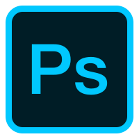
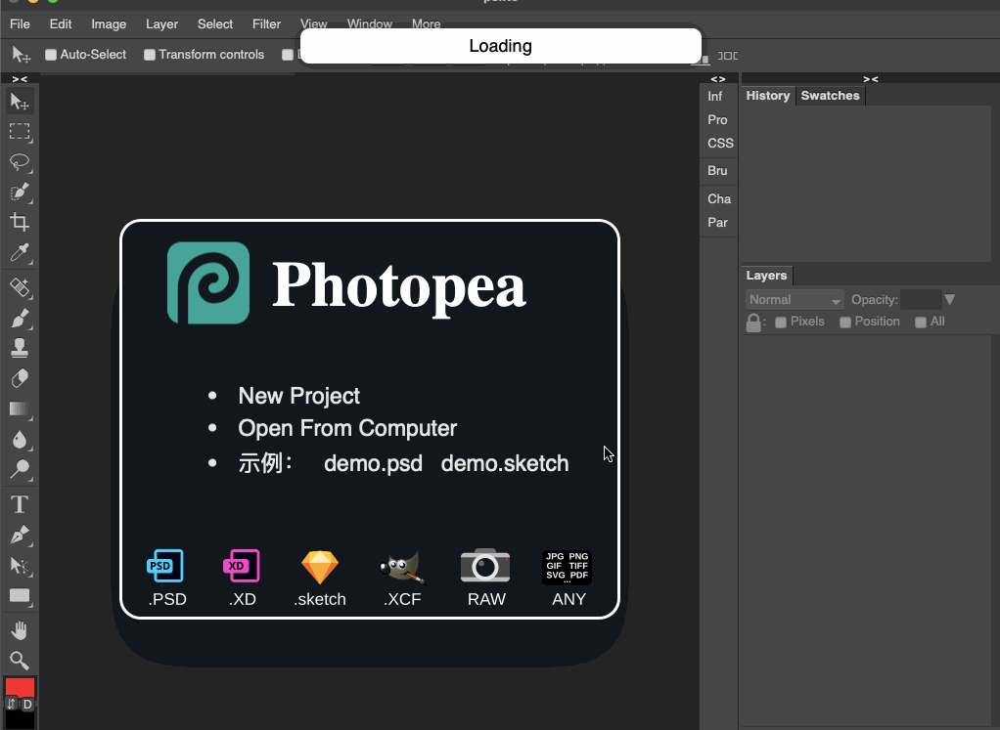

# pslite

轻量级`ps`, 在线服务: http://psd.im

需要自己手动编译

# 依赖

- Go 1.16
- npm

### MacOS

Make sure you have the xcode command line tools installed. This can be done by running:

`xcode-select --install`

### Linux

#### Debian/Ubuntu

`sudo apt install libgtk-3-dev libwebkit2gtk-4.0-dev`

_Debian: 8, 9, 10_

_Ubuntu: 16.04, 18.04, 19.04_

_Also succesfully tested on: Zorin 15, Parrot 4.7, Linuxmint 19, Elementary 5, Kali, Neon_, Pop!_OS

#### Arch Linux / ArchLabs / Ctlos Linux

`sudo pacman -S webkit2gtk gtk3`

_Also succesfully test on: Manjaro & ArcoLinux_

#### Centos

`sudo yum install webkitgtk3-devel gtk3-devel`

_CentOS 6, 7_

#### Fedora

`sudo yum install webkit2gtk3-devel gtk3-devel`

_Fedora 29, 30_

#### VoidLinux & VoidLinux-musl

`xbps-install gtk+3-devel webkit2gtk-devel`

#### Gentoo

`sudo emerge gtk+:3 webkit-gtk`

> 暂未测试过`linux`平台

